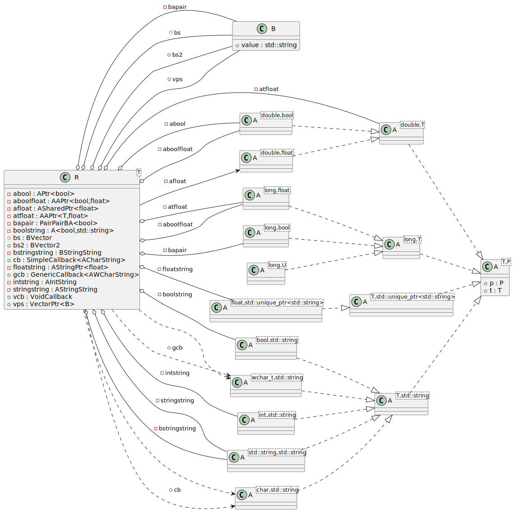
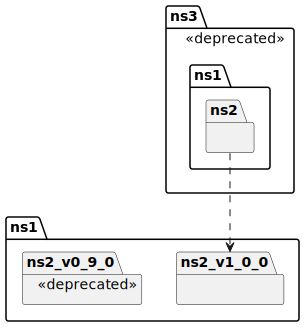

[<div align="center"></div>](https://github.com/bkryza/clang-uml/releases)

# C++ UML diagram generator based on Clang

[](https://github.com/bkryza/clang-uml/actions)
[](https://codecov.io/gh/bkryza/clang-uml)
[](https://github.com/bkryza/clang-uml/releases)
[](https://github.com/bkryza/clang-uml/releases)

`clang-uml` is an automatic C++ to UML class, sequence, package and include diagram generator, driven by
YAML configuration files. The main idea behind the
project is to easily maintain up-to-date diagrams within a code-base or document
legacy code. The configuration file or files for `clang-uml` define the
types and contents of each generated diagram.
The diagrams can be generated in [PlantUML](https://plantuml.com) and JSON formats.

`clang-uml` currently supports C++ up to version 17 with partial support for C++ 20.

Full documentation can be found [here](./docs/README.md).

To see what `clang-uml` can do, checkout the diagrams generated for unit
test cases [here](./docs/test_cases.md) or examples in
[clang-uml-examples](https://github.com/bkryza/clang-uml-examples) repository.

## Features

Main features supported so far include:

* **Class diagram generation**
    * Class properties and methods including access - [_example_](docs/test_cases/t00003.md)
    * Class inheritance - [_example_](docs/test_cases/t00002.md)
    * Other class relationships including associations, aggregations, dependencies and friendship - [_example_](docs/test_cases/t00006.md)
    * Template instantiation relationships - [_example_](docs/test_cases/t00014.md)
    * Template specialization and instantiation based on deduced context - [_example_](docs/test_cases/t00062.md)
    * Relationship inference from C++ containers and smart pointers - [_example_](docs/test_cases/t00007.md)
    * Diagram content filtering based on namespaces, elements and relationships - [_example_](docs/test_cases/t00040.md)
    * Optional package generation from namespaces - [_example_](docs/test_cases/t00036.md)
    * Optional package generation from subdirectories - [_example_](docs/test_cases/t00065.md)
    * Interactive links to online code to classes, methods and class fields in SVG diagrams - [_example_](https://raw.githubusercontent.com/bkryza/clang-uml/master/docs/test_cases/t00002_class.svg)
    * Support for plain C99/C11 code (struct and units relationships) - [_example_](docs/test_cases/t00057.md)
    * C++20 concept constraints - [_example_](docs/test_cases/t00059.md)
* **Sequence diagram generation**
    * Generation of sequence diagram from specific method or function - [_example_](docs/test_cases/t00002.md)
    * Generation of loop and conditional statements - [_example_](docs/test_cases/t20021.md)
    * Generation of switch statements - [_example_](docs/test_cases/t20024.md)
    * Generation of try/catch blocks - [_example_](docs/test_cases/t20023.md)
    * Handling of template code including constexpr conditionals - [_example_](docs/test_cases/t20018.md)
    * Handling of lambda expressions - [_example_](docs/test_cases/t20012.md)
    * Interactive links to online code to classes and call expressions - [_example_](https://raw.githubusercontent.com/bkryza/clang-uml/master/docs/test_cases/t20021_sequence.svg)
* **Package diagram generation**
    * Generation of package diagram based on C++ namespaces - [_example_](docs/test_cases/t30001.md)
    * Generation of package diagram based on subdirectories - [_example_](docs/test_cases/t30010.md)
    * Dependencies between packages based on symbols used in the code - [_example_](docs/test_cases/t30002.md)
    * Interactive links to online code to packages - [_example_](https://raw.githubusercontent.com/bkryza/clang-uml/master/docs/test_cases/t30002_package.svg)
* **Include graph diagram generation**
    * Show include graph for selected files - [_example_](docs/test_cases/t40001.md)

More comprehensive documentation can be found [here](./docs/README.md).

## Installation

Installation instructions for `Linux`, `macos` and `Windows` can be found
[here](./docs/installation.md).

## Usage

### Generating compile commands database

`clang-uml` requires an up-to-date
[compile_commands.json](https://clang.llvm.org/docs/JSONCompilationDatabase.html)
file, containing the list of commands used for compiling the source code.
Nowadays, this file can be generated rather easily using multiple methods:

* For [CMake](https://cmake.org/) projects, simply invoke the `cmake` command
  as `cmake -DCMAKE_EXPORT_COMPILE_COMMANDS=ON ...`
* For Make projects checkout [compiledb](https://github.com/nickdiego/compiledb)
  or [Bear](https://github.com/rizsotto/Bear)
* For Boost-based projects
  try [commands_to_compilation_database](https://github.com/tee3/commands_to_compilation_database)
* For SCons, invoke `compilation_db` tool (requires SCons > 4.0.0)
* For Microsoft Visual Studio projects try [Clang Power Tools](https://www.clangpowertools.com)

### Invocation

By default, `config-uml` will assume that the configuration file `.clang-uml`
and compilation database `compile_commands.json` files are in the
current directory, so if they are in the top level directory of a project,
simply run:

```bash
clang-uml
```

The output path for diagrams, as well as alternative location of
compilation database can be specified in `.clang-uml` configuration file.

For other options checkout help:

```bash
clang-uml --help
```

### Configuration file format and examples

Configuration files are written in YAML, and provide a list of diagrams
which should be generated by `clang-uml`. Basic example is as follows:

```yaml
compilation_database_dir: .
output_directory: puml
diagrams:
  myproject_class:
    type: class
    glob:
      - src/*.cc
    using_namespace:
      - myproject
    include:
      namespaces:
        - myproject
    exclude:
      namespaces:
        - myproject::detail
    plantuml:
      after:
        - 'note left of {{ alias("MyProjectMain") }}: Main class of myproject library.'
```

See [here](docs/configuration_file.md) for detailed configuration file reference guide.

## Examples

To see what `clang-uml` can do, checkout the test cases documentation [here](./docs/test_cases.md).

In order to see diagrams for the `clang-uml` itself, based on its own [config](.clang-uml) run
the following:

```bash
make clanguml_diagrams
```

and checkout the SVG diagrams in `docs/diagrams` folder.

### Class diagrams

#### Example

The following C++ code:

```cpp
template <typename T, typename P> struct A {
    T t;
    P p;
};

struct B {
    std::string value;
};

template <typename T> using AString = A<T, std::string>;
template <typename T> using AStringPtr = A<T, std::unique_ptr<std::string>>;

template <typename T>
using PairPairBA = std::pair<std::pair<B, A<long, T>>, long>;

template <class T> using VectorPtr = std::unique_ptr<std::vector<T>>;
template <class T> using APtr = std::unique_ptr<A<double, T>>;
template <class T> using ASharedPtr = std::shared_ptr<A<double, T>>;

template <class T, class U>
using AAPtr = std::unique_ptr<std::pair<A<double, T>, A<long, U>>>;

template <typename T> using SimpleCallback = std::function<void(T, int)>;
template <typename... T> using GenericCallback = std::function<void(T..., int)>;
using VoidCallback = GenericCallback<void *>;

using BVector = std::vector<B>;
using BVector2 = BVector;

using AIntString = AString<int>;
using ACharString = AString<char>;

using AStringString = AString<std::string>;
using BStringString = AStringString;

template <typename T> class R {
    using AWCharString = AString<wchar_t>;

    PairPairBA<bool> bapair;

    APtr<bool> abool;
    AAPtr<bool, float> aboolfloat;
    ASharedPtr<float> afloat;
    A<bool, std::string> boolstring;
    AStringPtr<float> floatstring;
    AIntString intstring;
    AStringString stringstring;
    BStringString bstringstring;
    AAPtr<T, float> atfloat;

protected:
    BVector bs;

public:
    BVector2 bs2;
    SimpleCallback<ACharString> cb;
    GenericCallback<AWCharString> gcb;
    VoidCallback vcb;
    VectorPtr<B> vps;
};
```

results in the following diagram (via PlantUML):



> Open the raw image [here](https://raw.githubusercontent.com/bkryza/clang-uml/master/docs/test_cases/t00014_class.svg),
> and checkout the hover tooltips and hyperlinks to classes and methods.

### Sequence diagrams

#### Example

The following C++ code:

```cpp
#include <atomic>
#include <functional>
#include <iostream>
#include <memory>
#include <string>

namespace clanguml {
namespace t20029 {
std::string encode_b64(std::string &&content) { return std::move(content); }

template <typename T> class Encoder : public T {
public:
    bool send(std::string &&msg)
    {
        return T::send(std::move(encode(std::move(msg))));
    }

protected:
    std::string encode(std::string &&msg) { return encode_b64(std::move(msg)); }
};

template <typename T> class Retrier : public T {
public:
    bool send(std::string &&msg)
    {
        std::string buffer{std::move(msg)};

        int retryCount = 5;

        while (retryCount--) {
            if (T::send(buffer))
                return true;
        }

        return false;
    }
};

class ConnectionPool {
public:
    void connect()
    {
        if (!is_connected_.load())
            connect_impl();
    }

    bool send(const std::string &msg) { return true; }

private:
    void connect_impl() { is_connected_ = true; }

    std::atomic<bool> is_connected_;
};

int tmain()
{
    auto pool = std::make_shared<Encoder<Retrier<ConnectionPool>>>();

    pool->connect();

    for (std::string line; std::getline(std::cin, line);) {
        if (!pool->send(std::move(line)))
            break;
    }

    return 0;
}
}
}
```

results in the following diagram (via PlantUML):


### Package diagrams

#### Example

The following C++ code:

```cpp
namespace clanguml {
namespace t30003 {

namespace ns1 {
namespace ns2_v1_0_0 {
class A {
};
}

namespace [[deprecated]] ns2_v0_9_0 {
class A {
};
}

namespace {
class Anon final {
};
}
}

namespace [[deprecated]] ns3 {

namespace ns1::ns2 {
class Anon : public t30003::ns1::ns2_v1_0_0::A {
};
}

class B : public ns1::ns2::Anon {
};
}
}
}
```

results in the following diagram (via PlantUML):



### Include diagrams

> In case you're looking for a simpler tool to visualize and analyze include graphs
> checkout my other tool - [clang-include-graph](https://github.com/bkryza/clang-include-graph)

#### Example

The following C++ code structure:

```
tests/t40001
├── include
│   ├── lib1
│   │   └── lib1.h
│   └── t40001_include1.h
└── src
    └── t40001.cc

```

results in the following diagram (via PlantUML) based on include directives in the code:


### Default mappings

| UML                                    | PlantUML   |
| ----                                   | ---        |
| Inheritance                            |  |
| Association                            |  |
| Dependency                             |  |
| Aggregation                            |  |
| Composition                            |  |
| Template specialization/instantiation  |  |
| Nesting (inner class/enum)             |  |
| Include (local)                        |  |
| Include (system)                       |  |

### Diagram content filtering

For typical code bases, generating a single diagram from entire code or even a single namespace can be too big to
be useful, e.g. as part of documentation. `clang-uml` allows specifying content to be included and excluded from
each diagram using simple YAML configuration:

```yaml
include:
  # Include only elements from these namespaces
  namespaces:
    - clanguml::common
    - clanguml::config
  # Include all subclasses of ClassA (including ClassA)
  subclasses:
    - clanguml::common::ClassA
  # and specializations of template Class<T> (including Class<T>)
  specializations:
    - clanguml::common::ClassT<T>
  # and all classes depending on Class D
  dependants:
    - clanguml::common::ClassD
  # and all dependencies of ClassE
  dependencies:
    - clanguml::common::ClassE
  # and classes in direct relation to ClassB (including ClassB)
  context:
    - clanguml::common::ClassB
  # Include only inheritance relationships
  relationships:
    - inheritance
exclude:
  # Exclude all elements from detail namespace
  namespaces:
    - clanguml::common::detail
  # and also exclude ClassF
  elements:
    - clanguml::common::ClassF
```

More details on this can be found in the [diagram filters](./docs/diagram_filters.md) documentation section.

### Test cases

The build-in test cases used for unit testing of the `clang-uml`, can be browsed [here](./docs/test_cases.md).

## Acknowledgements

This project relies on the following great tools:

* [Clang LibTooling](https://clang.llvm.org/docs/LibTooling.html) - a C++ library for creating tools based on Clang
* [PlantUML](https://plantuml.com/) - language and diagram for generating UML diagrams
* [Catch2](https://github.com/catchorg/Catch2) - C++ unit test framework
* [glob](https://github.com/p-ranav/glob) - Unix style path expansion for C++
* [indicators](https://github.com/p-ranav/indicators) - Activity indicators for modern C++
* [CLI11](https://github.com/CLIUtils/CLI11) - command line parser for C++
* [inja](https://github.com/pantor/inja) - a template engine for modern C++
* [backward-cpp](https://github.com/bombela/backward-cpp) - stack trace pretty printer for C++
* [yaml-cpp](https://github.com/jbeder/yaml-cpp) - YAML parser library for C++
* [spdlog](https://github.com/gabime/spdlog) - Fast C++ logging library
* [Doxygen](https://www.doxygen.nl/) - C++ documentation generator
* [Doxygen Awesome](https://jothepro.github.io/doxygen-awesome-css) - Doxygen CSS style

## Contributing

If you would like to contribute to the project, please check out [contributing guidelines](./CONTRIBUTING.md).

## LICENSE

    Copyright 2021-present Bartek Kryza <bkryza@gmail.com>

    Licensed under the Apache License, Version 2.0 (the "License");
    you may not use this file except in compliance with the License.
    You may obtain a copy of the License at

      http://www.apache.org/licenses/LICENSE-2.0

    Unless required by applicable law or agreed to in writing, software
    distributed under the License is distributed on an "AS IS" BASIS,
    WITHOUT WARRANTIES OR CONDITIONS OF ANY KIND, either express or implied.
    See the License for the specific language governing permissions and
    limitations under the License.
